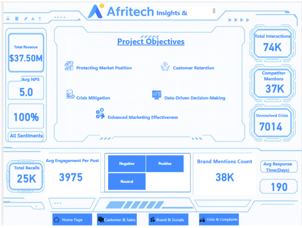
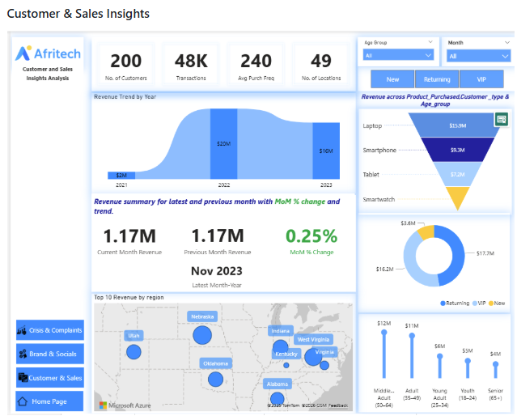
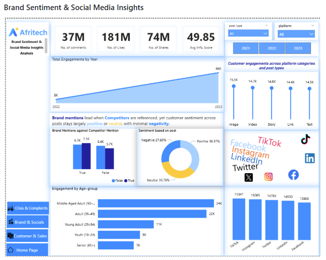
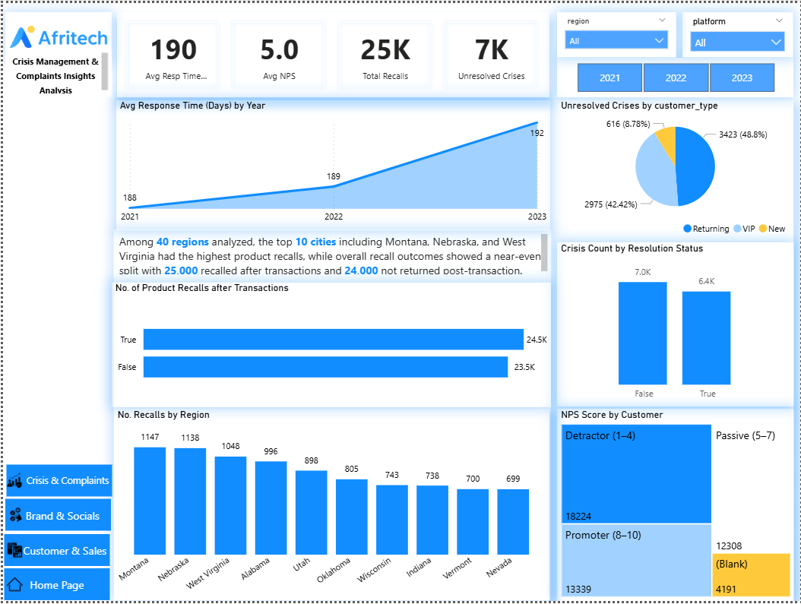
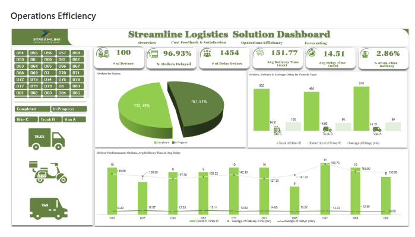
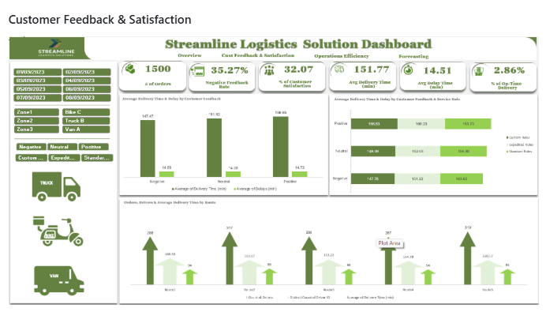
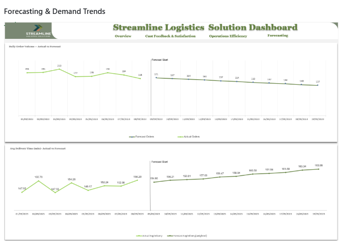
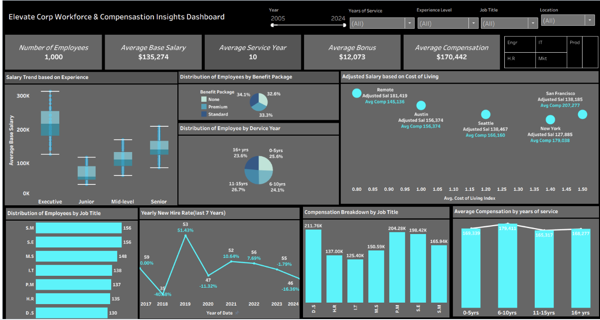

<!-- ================= HEADER ================= -->

  

  
  

---

## 💡 I solve business problems with data — not just build dashboards   

---

## 🚀 Signature Project  

  ### 📊 Retail Sales Performance & Profitability Dashboard (Power BI)

  **Key Insight:**
  Multi-channel retail data consolidated into a single Power BI dashboard — revealing $57.79M profit, 37% margins, and channel-level performance gaps across retail and e-commerce.

- Analysed **$155M revenue across 8K+ orders** from physical stores & e-commerce platforms
- Identified **top-performing cities, products & customers** driving revenue concentration
- Uncovered **wholesale as dominant channel** (~55% of total revenue) with year-end sales surge

👉 Enabled real-time KPI monitoring and year-over-year profitability tracking for strategic decision-making

🔗 https://github.com/Olu-DAnalyst/Retail-Sales-Performance-Profitability

---

## 👨‍💻 About Me  

Data Analyst focused on delivering **insight-driven solutions that improve business performance and support decision-making**.

I bring a strong combination of **analytical thinking and business understanding**, with experience across **operations, finance, and workforce analytics**.

- Identify trends, risks, and inefficiencies in complex datasets  
- Build dashboards that communicate insights clearly  
- Translate analysis into actionable business recommendations  

📍 Open to: **Data Analyst | BI Analyst | Reporting Analyst roles**

---

## 🧰 Tools & Technologies  

---

## ⭐ Featured Projects

### 📊 Customer Sentiment & Brand Risk Analysis (Power BI + SQL)
       

Analysed **74K+ social interactions and 38K brand mentions** to identify customer sentiment, unresolved complaints, and crisis risks.  
- Built interactive Power BI dashboard for KPI tracking  
- Identified key drivers of negative sentiment and recall impact  
- Delivered actionable insights for brand reputation management  

➡ **View Project:**  
https://github.com/Olu-DAnalyst/afritech-social-media-monitoring-dashboard

---

### 📦 Logistics Operations & Delivery Performance (Excel + Power Query + PivotTables) 
 .png)   

Developed an Excel dashboard to track delivery performance and operational efficiency.  
- Analysed delivery delays and backlog trends  
- Identified performance gaps across drivers and regions  
- Built interactive dashboard using PivotTables and charts

➡ **View Project:**  
https://github.com/Olu-DAnalyst/streamline-logistics-excel-dashboard

---

###  📊 Workforce & Compensation Analytics (Tableau) 

**Project Overview:**  
Developed an interactive Tableau dashboard analysing workforce distribution, salary trends by experience level, employee benefits allocation, and cost-of-living compensation adjustments across multiple locations to support HR analytics and strategic talent management.

**Impact:**  
Analysed workforce data for **1,000 employees**, uncovering salary disparities across experience levels, identifying benefits adoption trends, and highlighting cost-of-living compensation differences across major cities to support data-driven workforce planning and compensation strategy.

➡ **Repo:**  
https://github.com/Olu-DAnalyst/elevate-corp-workforce-compensation-analytics

---

###  🗄 Employee Retention & Workforce Analytics (SQL) 
 

Used SQL to analyse workforce data and uncover factors driving employee turnover.  
- Performed joins, aggregations, and trend analysis  
- Identified high-risk departments and salary patterns  
- Provided insights to support retention strategies
  
➡ **View Project:**   
https://github.com/Olu-DAnalyst/nextgen-employee-retention-sql-analysis

---

## 📈 What I Bring  

- Strong ability to translate data into **business decisions**  
- Experience analysing **operations, HR, and customer data**  
- Focus on **impact, not just dashboards**

---

## 🔎 Core Competencies

- Business Intelligence & Reporting
- Dashboard Development (Power BI & Tableau)
- SQL Querying & Data Extraction
- Data Cleaning & Transformation (Power Query)
- Data Modelling (Star Schema, ERD)
- KPI Development & Performance Tracking
- AI-assisted data analysis, reporting automation, and workflow optimisation
- Stakeholder Reporting & Data Storytelling

---

 ## 📈 Skills Demonstrated

- Data cleaning and transformation
- Exploratory data analysis
- Dashboard development
- KPI design
- Data visualization
- Business insight generation

---

## 🤝 Let’s collaborate
If you’re working on dashboards, reporting, analytics, or data storytelling, I’m happy to connect.

## 👤 Author

Oluwasegun Balogun  
Data Analyst | Business Intelligence

